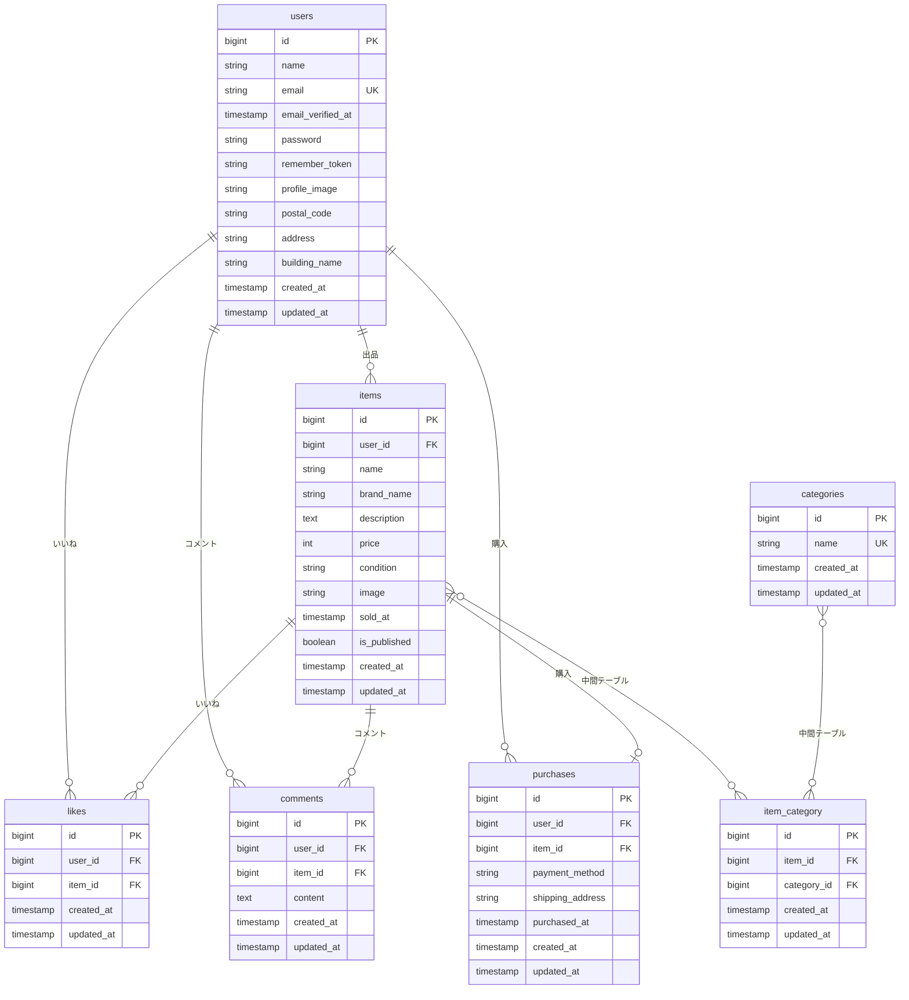

# Flea Market App

## 環境構築

### Docker ビルド

```bash
cd freemarket
docker-compose up -d --build
```

- MySQL のデータディレクトリは `~/coachtech-freemarket-mysql-data` に保存されます。初回起動時は自動的にディレクトリが作成されます。
- **重要**: Windows ファイルシステム（`/mnt/c/`）では権限の問題で MySQL が起動しない場合があります。その場合は、docker-compose.yml の MySQL ボリュームパスを `~/coachtech-freemarket-mysql-data` に設定してください（既に設定済み）。

### Laravel 環境構築

```bash
docker-compose exec php bash
cd /var/www
composer install
```

`.env.example`ファイルから`.env`を作成し、環境変数を変更

```bash
cp .env.example .env
php artisan key:generate
php artisan storage:link
php artisan migrate
php artisan db:seed
```

**注意事項:**

- `composer install`は`/var/www`ディレクトリで実行してください
- `.env`ファイルの作成と`php artisan`コマンドも`/var/www`ディレクトリで実行してください
- MySQL のデータディレクトリは`~/coachtech-freemarket-mysql-data`に保存されます。初回起動時は自動的にディレクトリが作成されます
- データベース接続情報は`docker-compose.yml`で設定済みです（`DB_HOST=mysql`, `DB_DATABASE=freemarket_db`, `DB_USERNAME=freemarket_user`, `DB_PASSWORD=freemarket_pass`）
- メール送信には MailHog が使用されます（`MAIL_HOST=mailhog`, `MAIL_PORT=1025`）

### Stripe API キーの設定

カード支払い機能を使用するには、Stripe の API キーを設定する必要があります。

1. [Stripe Dashboard](https://dashboard.stripe.com/)にログイン
2. 「開発者」→「API キー」からテスト用のシークレットキーを取得
3. `.env`ファイルに以下の設定を追加：

```env
STRIPE_SECRET_KEY=sk_test_xxxxxxxxxxxxxxxxxxxxx
```

**注意:** 本番環境では、必ず本番用の API キー（`sk_live_`で始まるキー）を使用してください。

## 使用技術(実行環境)

- PHP 8.1
- Laravel 8.75
- Laravel Fortify 1.13
- Laravel Sanctum 2.11
- MySQL 8.0.26
- Nginx 1.21.1
- phpMyAdmin
- Docker / Docker Compose
- Stripe PHP SDK
- MailHog

## ER 図



## 主要機能

### 認証機能

- 会員登録（メール認証対応）
- ログイン/ログアウト
- プロフィール編集

### 商品機能

- 商品一覧表示（おすすめ、マイリスト、出品した商品、購入した商品）
- 商品詳細表示
- 商品出品
- 商品管理（編集、公開/非公開切り替え）
- 商品検索

### インタラクション機能

- いいね機能（未ログイン時はセッションで管理）
- コメント機能
- 商品購入機能（コンビニ払い、カード支払い（Stripe））

## URL

- 開発環境：http://localhost/
- phpMyAdmin：http://localhost:8080/
- MailHog UI：http://localhost:8025/

## ストレージ

- プロフィール画像：`storage/app/public/profile_images/`
- 商品画像：`storage/app/public/items/`

## ダミーデータの作成

### 商品画像データの配置

商品画像データは以下のディレクトリに配置してください：

```
src/database/seeders/images/
```

#### 画像ファイル名の例

実際に使用されている画像ファイル名は以下の通りです：

- `Armani+Mens+Clock.jpg` (腕時計)
- `HDD+Hard+Disk.jpg` (HDD)
- `iLoveIMG+d.jpg` (玉ねぎ 3 束)
- `Leather+Shoes+Product+Photo.jpg` (革靴)
- `Living+Room+Laptop.jpg` (ノート PC)
- `Music+Mic+4632231.jpg` (マイク)
- `Purse+fashion+pocket.jpg` (ショルダーバッグ)
- `Tumbler+souvenir.jpg` (タンブラー)
- `Waitress+with+Coffee+Grinder.jpg` (コーヒーミル)
- `外出メイクアップセット.jpg` (メイクセット)

#### 対応画像形式

- JPEG (`.jpg`, `.jpeg`)
- PNG (`.png`)

#### 使用方法

1. 上記のディレクトリに画像ファイルを配置
2. `php artisan db:seed --class=ItemSeeder` を実行
3. シーダーが自動的に `storage/app/public/items/` に画像をコピーします

**注意**: ローカルの画像ファイルが見つからない場合は、Picsum Photos から自動的にダウンロードされます。それも失敗した場合は、SVG プレースホルダーが作成されます。

## ファイル構成

### モデルファイル (`app/Models/`)

- `User.php` - ユーザーモデル
- `Item.php` - 商品モデル
- `Category.php` - カテゴリーモデル
- `Like.php` - いいねモデル
- `Comment.php` - コメントモデル
- `Purchase.php` - 購入モデル

### Blade テンプレートファイル (`resources/views/`)

#### 認証関連 (`auth/`)

- `login.blade.php` - ログイン画面
- `register.blade.php` - 会員登録画面
- `verify-email.blade.php` - メール認証誘導画面
- `verify.blade.php` - メール認証画面

#### 商品関連 (`items/`)

- `index.blade.php` - 商品一覧画面（マイページ含む）
- `show.blade.php` - 商品詳細画面
- `sell.blade.php` - 商品出品画面
- `sell-complete.blade.php` - 出品完了画面
- `manage.blade.php` - 商品管理画面

#### 購入関連 (`purchase/`)

- `create.blade.php` - 商品購入画面
- `complete.blade.php` - 購入完了画面
- `edit-address.blade.php` - 配送先住所変更画面
- `stripe-success-popup.blade.php` - Stripe 決済成功ポップアップ

#### プロフィール関連 (`profile/`)

- `edit.blade.php` - プロフィール編集画面

#### レイアウト (`layouts/`)

- `app.blade.php` - 共通レイアウト

## テスト

```bash
docker-compose exec php php artisan test
```

## ルート仕様

### 認証関連

| URL                         | メソッド | ルート名              | コントローラー                            | 説明               |
| --------------------------- | -------- | --------------------- | ----------------------------------------- | ------------------ |
| `/login`                    | GET      | `login`               | `LoginController@showLoginForm`           | ログイン画面表示   |
| `/login`                    | POST     | -                     | `LoginController@login`                   | ログイン処理       |
| `/register`                 | GET      | `register`            | `RegisterController@showRegistrationForm` | 会員登録画面表示   |
| `/register`                 | POST     | -                     | `RegisterController@register`             | 会員登録処理       |
| `/logout`                   | POST     | `logout`              | Closure                                   | ログアウト処理     |
| `/email/verify`             | GET      | `verification.notice` | `EmailVerificationController@notice`      | メール認証誘導画面 |
| `/email/verify/{id}/{hash}` | GET      | `verification.verify` | `EmailVerificationController@verify`      | メール認証リンク   |

### プロフィール関連

| URL               | メソッド | ルート名         | コントローラー             | 説明                 |
| ----------------- | -------- | ---------------- | -------------------------- | -------------------- |
| `/mypage/profile` | GET      | `profile.edit`   | `ProfileController@edit`   | プロフィール編集画面 |
| `/mypage/profile` | POST     | `profile.update` | `ProfileController@update` | プロフィール更新処理 |

### 商品一覧・マイページ

| URL       | メソッド | ルート名      | コントローラー         | 説明                                               |
| --------- | -------- | ------------- | ---------------------- | -------------------------------------------------- |
| `/`       | GET      | `items.index` | `ItemController@index` | 商品一覧画面（未ログイン時）                       |
| `/mypage` | GET      | `mypage`      | `ItemController@index` | マイページ（ログイン時、デフォルトでおすすめタブ） |

### 商品詳細・いいね

| URL                  | メソッド | ルート名       | コントローラー               | 説明         |
| -------------------- | -------- | -------------- | ---------------------------- | ------------ |
| `/items/{item}`      | GET      | `items.show`   | `ItemController@show`        | 商品詳細画面 |
| `/items/{item}/like` | POST     | `items.like`   | `ItemLikeController@store`   | いいね登録   |
| `/items/{item}/like` | DELETE   | `items.unlike` | `ItemLikeController@destroy` | いいね解除   |

### 商品出品

| URL                           | メソッド | ルート名              | コントローラー                | 説明         |
| ----------------------------- | -------- | --------------------- | ----------------------------- | ------------ |
| `/sell`                       | GET      | `items.sell`          | `ItemSellController@create`   | 商品出品画面 |
| `/sell`                       | POST     | `items.sell.store`    | `ItemSellController@store`    | 商品出品処理 |
| `/items/{item}/sell/complete` | GET      | `items.sell.complete` | `ItemSellController@complete` | 出品完了画面 |

### 商品管理

| URL                    | メソッド | ルート名              | コントローラー                | 説明         |
| ---------------------- | -------- | --------------------- | ----------------------------- | ------------ |
| `/items/{item}/manage` | GET      | `items.manage`        | `ItemManageController@edit`   | 商品管理画面 |
| `/items/{item}/manage` | POST     | `items.manage.update` | `ItemManageController@update` | 商品更新処理 |

### コメント

| URL                      | メソッド | ルート名               | コントローラー                | 説明             |
| ------------------------ | -------- | ---------------------- | ----------------------------- | ---------------- |
| `/items/{item}/comments` | POST     | `items.comments.store` | `ItemCommentController@store` | コメント投稿処理 |

### 購入関連

| URL                               | メソッド | ルート名                  | コントローラー                     | 説明                        |
| --------------------------------- | -------- | ------------------------- | ---------------------------------- | --------------------------- |
| `/purchase/{item}`                | GET      | `purchase.create`         | `PurchaseController@create`        | 商品購入画面                |
| `/purchase/{item}`                | POST     | `purchase.store`          | `PurchaseController@store`         | 購入処理                    |
| `/purchase/{item}/complete`       | GET      | `purchase.complete`       | `PurchaseController@complete`      | 購入完了画面                |
| `/purchase/address/{item}`        | GET      | `purchase.address.edit`   | `PurchaseController@editAddress`   | 配送先住所変更画面          |
| `/purchase/address/{item}`        | POST     | `purchase.address.update` | `PurchaseController@updateAddress` | 配送先住所更新処理          |
| `/purchase/{item}/stripe/success` | GET      | `purchase.stripe.success` | `PurchaseController@stripeSuccess` | Stripe 決済成功コールバック |

**注意**: 購入関連のルートは認証必須です。
